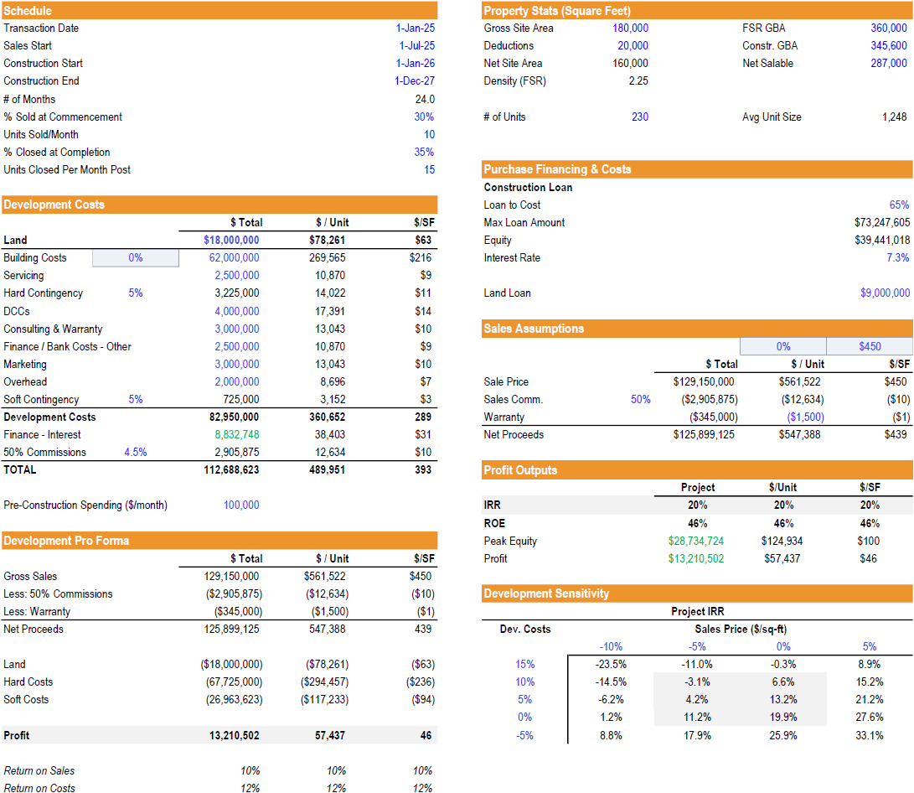
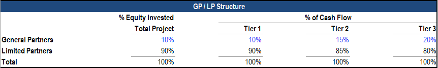

# Orlando Residential Condo Development – Real Estate Financial Modeling Case Study

## 📌 Project Overview

This project is a **real estate financial modeling case study** of a proposed **residential condominium development** in the **Orlando Metro Area (Florida, USA)**. The goal of this study is to evaluate the financial feasibility of a ground-up condo project using standard project finance methods, incorporating **development costs, financing assumptions, absorption schedules, and profit metrics**.

The study demonstrates my ability to build **dynamic Excel financial model** for real estate development, analyze **project risks and returns**, and benchmark assumptions against real-world Orlando market data.

---

## 🏢 Project Concept

* **Asset Type:** For-sale condominium development
* **Location:** Orlando Metro Area (submarkets: Downtown, Lake Nona, Winter Park)
* **Site Size:** \~4 acres (180,000 sq ft gross site area)
* **Product Type:** High-rise condo complex
* **Target Buyers:** Upper mid-market / family-oriented condo buyers

---

### Deal Summary

### General Partner / Limited Partner Structure

---

## 📈 Profitability Outputs

| Metric      | Output                        | Benchmark                         |
| ----------- | ----------------------------- | --------------------------------- |
| Project IRR | **19.9%**                     | Strong (15–18% typical)           |
| ROE         | **46%**                       | Very strong (25–35% typical)      |
| Peak Equity | \$28.7M                       | Reasonable at \~25% of cost       |
| Profit      | \$13.2M (\$57k/unit, \$46/sf) | Solid absolute return             |
| LP IRR      | 19.1%                         | Attractive to investors           |
| GP IRR      | 26.1%                         | Reflects carried interest/promote |

---

## 📊 Key Insights

* **Feasibility:** With a 20% IRR and 46% ROE, this project is financially attractive, assuming strong absorption and sales pricing.
* **Risk Factors:** Construction cost volatility, sales absorption pace, and pricing sensitivity (a 5–10% shift can significantly impact IRR).
* **Market Alignment:** Benchmarked against real Orlando condo comps in Downtown, Lake Nona, and Winter Park.

---

## 🛠️ Tools & Methods

* **Excel for financial modeling**
* **DCF (Discounted Cash Flow) modeling** for IRR and NPV calculations
* **Waterfall structures** for LP/GP IRR analysis

## 📎 References

* Recent Orlando apartment complex (Downtown, Lake Nona, Winter Park)

---

✅ This case study demonstrates how to evaluate the **financial feasibility of a building development project**, with detailed assumptions, costs, financing, and investor returns.

---
